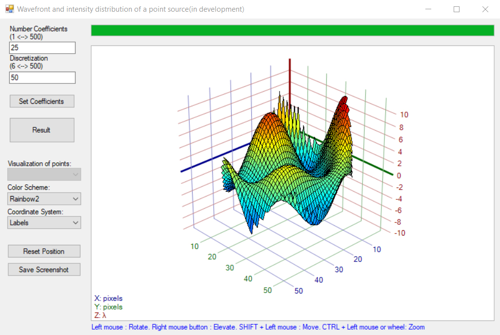
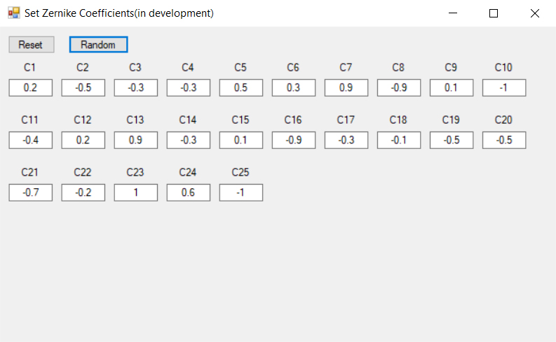

# Phase problem
Этот проект является переносом [решения фазовой проблемы](https://github.com/Stergrim/Solving-the-phase-problem) с **Matlab** на **C#** с добавлением графического интерфейса.

## Каталоги
>**Graph3D**: сторонний проект для 3D отрисовки поверхности  
>**Phase-problem-main**: папка основного проекта  
>**Release**: сборка решения в виде exe файла  
>**demos**: графический материал для README  

## Этапы
Этапы, описанные ниже, соответствуют [примеру запуска решения фазовой проблемы](https://github.com/Stergrim/Solving-the-phase-problem/tree/main/demos#readme):  
этап №1 – 1, 2, 3 пункты;  
этап №2 – 4 пункт;  
этап №3 – 5, 6 пункты.  

### **Этап №1 (+)**
1. Расчёт полиномов Цернике **(+)**
2. Формирование волнового фронта **(+)**
3. Визуализация волнового фронта **(+)**
4. Пользовательский интерфейс **(+)**
5. Рефакторинг кода **(+)**

**Результаты:**  
***Главное окно приложения***
 
<figure>

</figure>

***Окно для определения коэффицинтов Цернике***

<figure>

</figure>

### **Этап №2 (…)**
1. Расчёт распределения интенсивности **(…)**
2. Визуализация в виде двумерного изображения **(…)**
3. Добавление в основную форму вкладки с изображением картины распределения интенсивности и вкладки с задаваемыми параметрами **(…)**

### **Этап №3 (…)**
1. Реализация метода оптимизации многомерной функции **(…)**
2. Визуализация результатов в отдельной вкладке основного окна **(…)**
